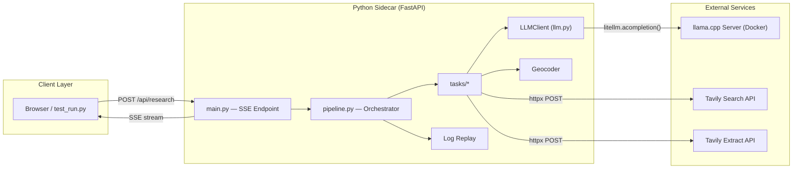
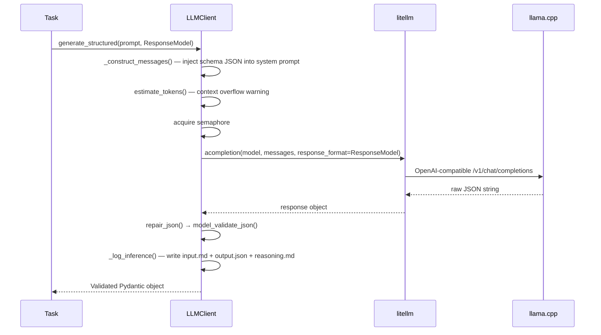
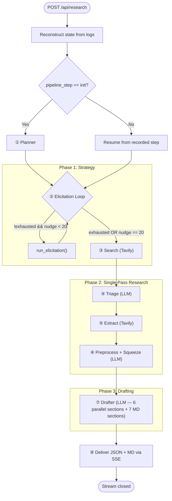
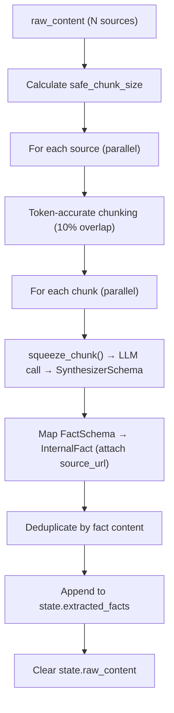
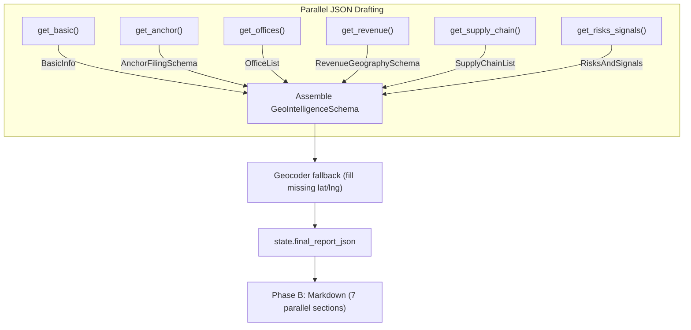
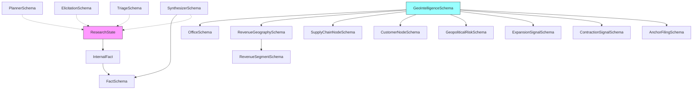

# Dossigraphica Deep Research Pipeline — Full Architectural Review

> [!NOTE]
> This document is a forensic, code-level walkthrough of every component in the current pipeline as of 2026-04-12. It is derived directly from the source files in `python-sidecar/`, the architecture doc in `docs/`, and the infrastructure in `docker-compose.yaml` / `.env`.

---

## 1. System Architecture Overview

The system is a **local-first Geo-Intelligence research agent**. A user submits a company/query, and the pipeline autonomously searches the web, extracts content, reasons over it, and produces a structured intelligence brief (JSON + Markdown) — all streamed back in real-time via SSE.



### Components at a Glance

| Component | File(s) | Role |
|---|---|---|
| **API Server** | [main.py](file:///home/dogecat0/documents/dossigraphica/python-sidecar/main.py) | FastAPI app, single SSE endpoint `/api/research` |
| **Orchestrator** | [pipeline.py](file:///home/dogecat0/documents/dossigraphica/python-sidecar/pipeline.py) | Single-pass async generator driving the entire research lifecycle |
| **LLM Client** | [llm.py](file:///home/dogecat0/documents/dossigraphica/python-sidecar/llm.py) | Singleton wrapper around `litellm`, handles structured generation, logging, token counting, Map-Reduce summarization |
| **Tasks** | [tasks/](file:///home/dogecat0/documents/dossigraphica/python-sidecar/tasks/) | 7 task modules (planner, elicitation, search, triage, extractor, preprocessor, drafter) |
| **Schemas** | [schemas.py](file:///home/dogecat0/documents/dossigraphica/python-sidecar/schemas.py) | All Pydantic models: `ResearchState`, task I/O schemas, final `GeoIntelligenceSchema` |
| **Geocoder** | [geocoder.py](file:///home/dogecat0/documents/dossigraphica/python-sidecar/utils/geocoder.py) | Offline country→lat/lng fallback from `public/data/countries.json` |
| **Log Replay** | [log_replay.py](file:///home/dogecat0/documents/dossigraphica/python-sidecar/utils/log_replay.py) | State reconstruction from `logs/inference/` for crash recovery / resume |
| **LLM Server** | [docker-compose.yaml](file:///home/dogecat0/documents/dossigraphica/docker-compose.yaml) | `ghcr.io/ggml-org/llama.cpp:server-cuda` running **Gemma 4 E4B** (Q4_K_XL) |

---

## 2. Infrastructure Layer

### 2.1 LLM Server (llama.cpp in Docker)

Runs the **Gemma 4 E4B** GGUF model via llama.cpp's CUDA server image.

| Setting | Value | Purpose |
|---|---|---|
| `CTX_SIZE` | 65536 | Total KV cache budget across all parallel slots |
| `N_PARALLEL` | 4 | Concurrent inference slots |
| `CTX_PER_REQUEST` | 16384 | Per-request context window (enforced by `LLMClient`) |
| `OUTPUT_RESERVATION` | 6144 | Tokens reserved for model output per request |
| `CACHE_TYPE_K/V` | q8_0 | Quantized KV cache for VRAM efficiency |
| `FLASH_ATTN` | true | Flash Attention enabled |
| `REASONING` | on | Chain-of-thought mode active |

> [!IMPORTANT]
> The architecture doc described a **multi-model delegation matrix** (Qwen 3.5 for planning, LFM 2.5 for extraction). The current implementation uses a **single model** (Gemma 4 E4B) for ALL tasks. Model swapping has not been implemented.

### 2.2 Tavily API

Used for two purposes:
1. **Search** (`POST https://api.tavily.com/search`) — web search with `basic` depth, 5 results per query.
2. **Extract** (`POST https://api.tavily.com/extract`) — full-page content extraction from URLs, batched in chunks of 20.

### 2.3 SearXNG (Commented Out)

The docker-compose still has a SearXNG definition, but it is **commented out**. Search has been fully migrated to Tavily.

---

## 3. The `ResearchState` — Central Data Object

Defined in [schemas.py:20-33](file:///home/dogecat0/documents/dossigraphica/python-sidecar/schemas.py#L20-L33). This Pydantic model is the **single mutable object** threaded through every task.

```python
class ResearchState(BaseModel):
    user_query: str
    pipeline_step: str = "init"         # FSM position for resume
    scratchpad: str = ""                # Accumulated reasoning/audit trail
    extracted_facts: List[InternalFact] = []  # The core intelligence
    urls: List[str] = []                # Current target URLs
    search_queries: List[str] = []      # Current search query set
    search_results: List[dict] = []     # Raw search result metadata
    raw_content: List[dict] = []        # Extracted page content (ephemeral)
    nudge_count: int = 0                # Elicitation loop counter
    is_exhausted: bool = False          # Elicitation termination flag
    is_complete: bool = False           # Research loop termination flag
    final_report_md: str = ""           # Output: Markdown brief
    final_report_json: Optional[dict] = None  # Output: Structured JSON
```

### `InternalFact` — The Atomic Intelligence Unit

```python
class InternalFact(FactSchema):
    source_url: str | None  # Programmatic metadata, not from LLM
```

Each fact has: `reasoning`, `content`, `category` (one of 7: `CORPORATE`, `OFFICES`, `REVENUE`, `SUPPLY_CHAIN`, `CUSTOMERS`, `RISKS`, `SIGNALS`), and `source_url`.

---

## 4. The `LLMClient` — Inference Engine

Singleton at [llm.py:221](file:///home/dogecat0/documents/dossigraphica/python-sidecar/llm.py#L221): `llm = LLMClient()`.

### Key Capabilities

| Method | Purpose |
|---|---|
| `generate_structured(prompt, response_model, system_prompt)` | Core inference. Constructs messages with schema injection, calls `litellm.acompletion()`, repairs JSON via `json_repair`, validates via Pydantic |
| `estimate_tokens(messages)` | Token counting via `litellm.token_counter()` |
| `calculate_safe_chunk_size(sys_prompt, template, model)` | Calculates remaining token budget after overhead |
| `summarize_to_fit(content, target_tokens)` | **Map-Reduce recursive summarization** — chunks content, summarizes each chunk in parallel, recurses until under budget |

### Concurrency Model

- **`asyncio.Semaphore(LLAMA_N_PARALLEL)`** — caps concurrent LLM calls to match the llama.cpp slot count (4).
- **`asyncio.Lock()`** (`counter_lock`) — protects the monotonically increasing inference log counter.

### Structured Generation Flow



### Inference Logging

Every LLM call produces 3 files in `logs/inference/`:
- `{NNNN}_{SchemaName}_input.md` — full system + user prompt
- `{NNNN}_{SchemaName}_output.json` — raw parsed JSON
- `{NNNN}_{SchemaName}_reasoning.md` — extracted reasoning field

The counter initializes from existing log files on startup to support **idempotent replay**.

---

## 5. Pipeline Orchestration (`pipeline.py`)

The core engine. It's an **async generator** that `yield`s JSON status updates consumed by the SSE endpoint. The pipeline follows a **single-pass** linear flow — the Elicitation loop guarantees exhaustive query coverage upfront, eliminating the need for a costly reflector feedback loop.

### Configurable Limits

| Variable | Default | Purpose |
|---|---|---|
| `ELICITATION_MAX_NUDGES` | 20 | Max elicitation iterations |

### High-Level Flow



### Step-by-Step Execution

The orchestrator uses `state.pipeline_step` as a **finite state machine** position marker. Each task transitions the step forward. On resume (via `reconstruct_state_from_logs`), the pipeline skips completed steps entirely.

**FSM Transitions:** `init` → `elicitation` → `searching` → `triage` → `extracting` → `preprocessing` → `drafting` → `completed`

---

## 6. Task Modules — Deep Dive

### ① Planner ([planner.py](file:///home/dogecat0/documents/dossigraphica/python-sidecar/tasks/planner.py))

| Aspect | Detail |
|---|---|
| **Input** | `state.user_query` |
| **LLM Schema** | `PlannerSchema` → `{reasoning, search_queries[]}` |
| **System Prompt** | "Elite Geo-Intelligence Research Strategist" |
| **User Prompt** | Injects full `INTELLIGENCE_GOALS` (6 modules: Corporate Footprint, Revenue Geography, Supply Chain, Customer Concentration, Geopolitical Risks, Strategic Signals) |
| **State Mutation** | Appends reasoning to `scratchpad`, merges `search_queries` (deduped via `set`) |
| **LLM Calls** | 1 |

Primary sources emphasized: SEC filings (10-K, 10-Q, 8-K), earnings transcripts, official press releases.

---

### ② Elicitation ([elicitation.py](file:///home/dogecat0/documents/dossigraphica/python-sidecar/tasks/elicitation.py))

| Aspect | Detail |
|---|---|
| **Input** | `state.search_queries`, `state.user_query` |
| **LLM Schema** | `ElicitationSchema` → `{reasoning, critique, additional_items[], is_exhausted}` |
| **System Prompt** | "Relentless Geo-Intelligence Director" |
| **Loop** | Runs up to `ELICITATION_MAX_NUDGES` (20) times OR until model sets `is_exhausted = true` |
| **State Mutation** | Merges `additional_items` into `search_queries` (deduped), increments `nudge_count`, sets `is_exhausted` |
| **LLM Calls** | 1 per nudge iteration (up to 20) |

> [!TIP]
> This is the "**Is That All?**" protocol from Module E of the architecture doc. It programmatically fights "generation fatigue" — the tendency of small models to produce shallow, incomplete query lists.

---

### ③ Search ([search.py](file:///home/dogecat0/documents/dossigraphica/python-sidecar/tasks/search.py))

| Aspect | Detail |
|---|---|
| **Input** | `state.search_queries` |
| **External API** | Tavily Search (`POST /search`, `search_depth: basic`, `max_results: 5`) |
| **Concurrency** | All queries executed in parallel via `asyncio.gather()` |
| **Deduplication** | Results deduplicated by URL in a `dict` |
| **State Mutation** | Sets `search_results` (list of `{url, content, title, query}`), sets `urls` |
| **Logging** | Writes `SearchData_output.json` for replay |
| **LLM Calls** | 0 |

---

### ④ Triage ([triage.py](file:///home/dogecat0/documents/dossigraphica/python-sidecar/tasks/triage.py))

| Aspect | Detail |
|---|---|
| **Input** | `state.search_results` |
| **LLM Schema** | `TriageSchema` → `{reasoning, top_urls[]}` |
| **System Prompt** | "Expert Geo-Intelligence Triagist" — focus on SEC filings and primary sources |
| **Strategy** | Groups search results by originating query, runs **one LLM triage call per query group** in parallel |
| **Context Management** | Calculates token budget, uses `summarize_to_fit()` if snippets exceed capacity |
| **Ranking Hierarchy** | Tier 1: SEC Filings, Earnings. Tier 2: Bloomberg/WSJ/Reuters/FT. Tier 3: Trade pubs |
| **Fallback** | On LLM error, selects top 3 URLs from each group |
| **State Mutation** | Merges all `top_urls` (deduped), appends triage reasoning to `scratchpad`, updates `state.urls` |
| **LLM Calls** | 1 per unique query group (parallel) |

---

### ⑤ Extractor ([extractor.py](file:///home/dogecat0/documents/dossigraphica/python-sidecar/tasks/extractor.py))

| Aspect | Detail |
|---|---|
| **Input** | `state.urls` |
| **External API** | Tavily Extract (`POST /extract`, `extract_depth: basic`) |
| **Batching** | URLs chunked into groups of 20 (Tavily API limit), executed concurrently |
| **Idempotency** | Skips URLs already in `state.extracted_facts` (by `source_url`) |
| **State Mutation** | Sets `raw_content` (list of `{url, content, query}`) |
| **Logging** | Writes `ExtractorData_output.json` for replay |
| **LLM Calls** | 0 |

---

### ⑥ Preprocessor ([preprocessor.py](file:///home/dogecat0/documents/dossigraphica/python-sidecar/tasks/preprocessor.py))

This is the **most compute-intensive task** — the "Early Semantic Squeeze".

| Aspect | Detail |
|---|---|
| **Input** | `state.raw_content` |
| **LLM Schema** | `SynthesizerSchema` → `{reasoning, extracted_facts[{reasoning, content, category}]}` |
| **System Prompt** | "Senior Geo-Intelligence Analyst... exhaustive forensic data extraction" |
| **Strategy** | 3-stage pipeline per source document |

#### Internal Flow



**Key Mechanisms:**

1. **Dynamic Chunk Sizing** — Uses `calculate_safe_chunk_size()` with the longest query among sources to determine the max safe token count per chunk.
2. **Token-Accurate Splitting** — Uses `litellm.encode()`/`litellm.decode()` for precise token-boundary chunking. Falls back to character estimation (`chunk_size * 4`) if tokenization fails.
3. **10% Overlap** — Ensures no information is lost at chunk boundaries.
4. **Parallel Processing** — All sources processed concurrently, all chunks within a source processed concurrently (bounded by the `LLMClient` semaphore at 4 parallel slots).
5. **Deduplication** — Facts deduplicated by `content` string across new + existing facts.

**Fact Categories:** `CORPORATE`, `OFFICES`, `REVENUE`, `SUPPLY_CHAIN`, `CUSTOMERS`, `RISKS`, `SIGNALS`.

| **LLM Calls** | 1 per chunk, across all sources. For a pipeline processing 10 sources with avg. 3 chunks each = ~30 LLM calls (throttled by semaphore to 4 concurrent). |
|---|---|

---

### ⑦ Drafter ([drafter.py](file:///home/dogecat0/documents/dossigraphica/python-sidecar/tasks/drafter.py))

The most complex task — produces both the **structured JSON** (`GeoIntelligenceSchema`) and the **Markdown narrative brief**.

#### Phase A: Structured JSON Assembly (6 parallel LLM calls)



| Sub-task | Schema | Fact Categories | Geocoder |
|---|---|---|---|
| `get_basic()` | `BasicInfo` (ad-hoc) | `CORPORATE`, `REVENUE` | No |
| `get_anchor()` | `AnchorFilingSchema` | `CORPORATE` | No |
| `get_offices()` | `OfficeList` → `List[OfficeSchema]` | `OFFICES`, `CORPORATE` | **Yes** — fills missing lat/lng from country name |
| `get_revenue()` | `RevenueGeographySchema` | `REVENUE` | No |
| `get_supply_chain()` | `SupplyChainList` → `List[SupplyChainNodeSchema]` | `SUPPLY_CHAIN` | **Yes** |
| `get_risks_signals()` | `RisksAndSignals` (combined) | `RISKS`, `SIGNALS`, `CUSTOMERS` | **Yes** — on risks, expansion signals, contraction signals, and customers |

**Template Strategy:** Uses `__MARKER__` placeholders (`__QUERY__`, `__FACTS__`) instead of Python f-string braces to avoid `KeyError` when templates contain JSON-like content.

**Context Management:** Each sub-task calls `get_fact_subset()` which filters facts by category, formats them, calculates token overhead, and calls `summarize_to_fit()` if the fact block exceeds the available context window.

#### Phase B: Markdown Narrative (7 parallel LLM calls)

After the JSON is assembled, 7 `MarkdownSectionSchema` calls generate the human-readable brief:

1. Geographic Profile Summary
2. MODULE A: Corporate Footprint
3. MODULE B: Revenue Geography
4. MODULE C: Supply Chain Map
5. MODULE D: Customer Concentration
6. MODULE E: Regulatory Risk
7. MODULE F: Strategic Signals

Each section receives the **already-validated JSON** from Phase A as its data source.

| **Total LLM Calls** | 6 (JSON) + 7 (Markdown) = **13 parallel calls** (bounded by semaphore to 4 concurrent) |
|---|---|

---

## 7. Crash Recovery — Log Replay

[log_replay.py](file:///home/dogecat0/documents/dossigraphica/python-sidecar/utils/log_replay.py) reconstructs `ResearchState` from the `logs/inference/` directory.

### Replay Logic

Scans all `*_output.json` files, sorts by index prefix, and replays state mutations:

| Log File Pattern | State Mutation | Resolved Step |
|---|---|---|
| `PlannerSchema` | Load `search_queries` | `elicitation` |
| `ElicitationSchema` | Extend `search_queries`, increment `nudge_count`, set `is_exhausted` | `searching` |
| `SearchData` | Load `search_results`, `urls` | `triage` |
| `TriageSchema` | Accumulate `top_urls` into buffer | `extracting` |
| `ExtractorData` | Load `raw_content` | `preprocessing` |
| `SynthesizerSchema` | Reconstruct `InternalFact` objects | `drafting` |

> [!WARNING]
> The replay mechanism parses output JSONs but does **not** replay scratchpad content. When resuming, the `scratchpad` will be empty, which means triage reasoning trails are lost.

---

## 8. The Geocoder Fallback

[geocoder.py](file:///home/dogecat0/documents/dossigraphica/python-sidecar/utils/geocoder.py) provides offline coordinate resolution.

- Loads `public/data/countries.json` (GeoJSON with bounding boxes).
- Builds a lookup map: country name (lowercase) + ISO A2/A3 codes → centroid `{lat, lng}`.
- Hard-coded fuzzy matches for `USA`, `China`, `Taiwan`.
- Used exclusively by the **Drafter** to fill `null` lat/lng on offices, supply chain nodes, risks, signals, and customers.
- Tags filled coordinates with `confidence: 'city_center_approximation'` (offices only).

---

## 9. Delivery Layer

### SSE Stream

[main.py](file:///home/dogecat0/documents/dossigraphica/python-sidecar/main.py) wraps the `research_pipeline()` async generator in `EventSourceResponse`.

Each `yield` from the pipeline is a JSON string with:

```json
{
  "status": "planning|elicitation|searching|triage|extracting|preprocessing|drafting|completed|error",
  "message": "Human-readable status",
  "progress": 0-100,
  "queries": ["..."],           // during elicitation/search
  "report": "...md...",         // on completion
  "data": { GeoIntelligenceSchema }  // on completion
}
```

### CLI Test Runner

[test_run.py](file:///home/dogecat0/documents/dossigraphica/python-sidecar/test_run.py) consumes the async generator directly (no HTTP), displays a `tqdm` progress bar, and writes `test_report.md` + `test_data.json` on completion.

---

## 10. Full LLM Call Budget (Single Pipeline Run)

| Phase | Task | LLM Calls | Parallelism |
|---|---|---|---|
| Strategy | Planner | 1 | Sequential |
| Strategy | Elicitation (×N nudges) | 1–20 | Sequential per nudge |
| Research | Triage | ~Q (1 per query group) | Parallel |
| Research | Preprocessor | ~S×C (sources × chunks) | Parallel (semaphore=4) |
| Drafting | JSON Sections | 6 | Parallel |
| Drafting | Markdown Sections | 7 | Parallel |

**Worst case** (20 nudges, 30 query groups, 15 sources × 3 chunks):
`1 + 20 + 30 + 45 + 6 + 7 = ~109 LLM calls`

**Typical case** (5 nudges, 10 query groups, 8 sources × 2 chunks):
`1 + 5 + 10 + 16 + 6 + 7 = ~45 LLM calls`

---

## 11. Schema Dependency Graph



All schemas use `ConfigDict(extra='forbid', strict=True)` — the LLM cannot output extraneous fields.

---

## 12. Key Architectural Observations

> [!NOTE]
> These are observations from the code review, not criticisms. They document the delta between the v3 architecture doc and the current implementation.

1. **Single Model** — The multi-model delegation matrix (Gemma 4 for reasoning, LFM 2.5 for extraction) has been collapsed to Gemma 4 E4B for everything. This simplifies infra but means extraction/triage tasks consume the same VRAM as planning.

2. **No LangGraph** — The architecture doc references LangGraph DAG orchestration. The current implementation uses a **pure Python async generator** with `pipeline_step` as a manual FSM. This is simpler and has zero dependency overhead.

3. **SearXNG Removed** — Discovery has moved entirely to Tavily Search. The SearXNG container is commented out in docker-compose.

4. **No `outlines` Integration** — The architecture doc describes token-level schema enforcement via `outlines` FSM. The current implementation relies on `litellm`'s `response_format` parameter + `json_repair` + Pydantic validation. `outlines` is in `requirements.txt` but unused in code.

5. **Scratchpad Not Replayed** — Log replay reconstructs facts and queries but not the `scratchpad` string. This means triage reasoning trails are lost on crash recovery.

6. **Reflector Removed** — The v3 architecture doc describes a 6-module adversarial reflector that bounced the pipeline back to search on gap detection. This has been intentionally removed because the feedback loop re-consumed Tavily API credits and LLM compute on every bounce. The Elicitation loop (up to 20 nudges) now serves as the sole quality gate for query exhaustiveness, and the Preprocessor serves as the quality gate for fact extraction. This reduced worst-case LLM calls from ~1,339 to ~109.

7. **Geocoder is Country-Level Only** — Falls back to country centroids. No city-level geocoding exists. Offices in the same country will have identical coordinates.
